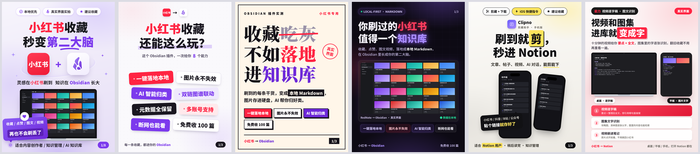

# social-media-cover

Generate social media cover images — Xiaohongshu (RedNote), Douyin, Bilibili, WeChat — as **1080×1440 PNGs by writing HTML and screenshotting it with Chrome**, not by AI image generation.

[中文文档](./README.zh.md)



## Why not AI image generation

Every AI-generated poster I tried had the same problems: garbled Chinese characters, logos that looked like knockoffs, no way to embed a real product screenshot, and changing one word meant regenerating the whole image with everything else drifting.

Writing the poster as HTML/CSS and screenshotting it fixes all of that:

| | AI image gen | HTML → screenshot |
|---|---|---|
| Chinese text | frequent garbled/missing characters | pixel-exact, WYSIWYG |
| Brand logos | approximated, looks fake | exact SVG/CSS, or drop in the official file |
| Real product UI | can't embed | real screenshots inside device mockups |
| Change one word | regenerate everything | edit one line, re-screenshot |
| Series consistency | drifts every image | parameterized, consistent by construction |

The tradeoff: it burns more tokens than a text-to-image call, because the agent writes a full HTML document. In exchange you get output that is **controllable, reproducible, and batchable**.

## Requirements

**Required**

- **Playwright CLI** — `pip install playwright && playwright install chromium` (or `brew install playwright`)
- **Chrome / Chromium** — templates default to `--channel chrome`; drop that flag to use Playwright's bundled Chromium
- **A CJK font** — templates ship with a fallback chain (Noto Sans SC → PingFang SC → Microsoft YaHei → Source Han Sans SC → Hiragino Sans GB). Online, Noto Sans SC loads from Google Fonts; offline it falls back to a system font with near-identical results

**Optional**

- **ImageMagick 7** (`magick`) — cropping screenshots and masking sensitive regions. You'll want it for almost any real mockup

## Installation

### Option 1 — one line (recommended)

```bash
npx skills add EwingYangs/social-media-cover
```

### Option 2 — Claude Code plugin marketplace

In Claude Code:

```
/plugin marketplace add EwingYangs/social-media-cover
/plugin install social-media-cover@social-media-cover
```

Or run `/plugin marketplace add EwingYangs/social-media-cover`, then pick **Browse and install plugins** from the menu.

### Option 3 — manual

```bash
git clone https://github.com/EwingYangs/social-media-cover.git ~/.claude/skills/social-media-cover
```

Works with any agent that reads `SKILL.md` — Claude Code, Codex, Cursor, or your own harness. For other tools, point them at the folder or copy `SKILL.md` into your prompt.

### Verify your setup

```bash
cd ~/.claude/skills/social-media-cover
bash scripts/render.sh assets/template-cover.html /tmp/out.png && open /tmp/out.png
```

If you get a 1080×1440 poster, you're good. Then just ask your agent for a product cover — it will pick a template, drop your screenshot into the device mockup, and render.

## Making your own cover

1. Copy a template from `assets/` into a working directory, along with your product screenshot
2. Edit the CSS variables (`--red` = source-platform color, `--purple` = destination-tool color), the headline, and the `` inside the mockup
3. Render:
   ```bash
   playwright screenshot --channel chrome --viewport-size "1080,1440" \
     --wait-for-timeout 3500 "file://$PWD/index.html" cover.png
   ```
4. **Open the PNG and check it.** Layout overflow on a fixed 1080×1440 canvas is silent — nothing errors, the footer is just gone

## What's in here

```
assets/
├── template-cover.html      playful gradient (default)
├── tagwall-cover.html       capability tag wall
├── bigtype-cover.html       big-type contrast poster
├── neon-cover.html          dark neon glass
├── cliptape-cover.html      black/yellow cut-and-paste, dual iPhone
├── dualdevice-cover.html    MacBook + iPad side by side
├── kit.css                  device mockups (MacBook / iPad / iPhone) + logo lockup
├── demo-*.png               placeholder screenshots (mock data, safe to ship)
└── _mock-src/               the HTML used to generate those placeholders
examples/
└── template-previews/       rendered preview of each template
scripts/
└── render.sh                one-line render helper
SKILL.md                     full agent instructions, workflow, and the gotcha table
```

## Device mockups

`kit.css` gives you three, all with correct screen aspect ratios:

- `.mac` — MacBook, 16:10 screen, base wider than the screen
- `.ipad` — iPad portrait, 1668/2388, narrow bezel, camera dot
- `.phone` — iPhone, 1170/2532, Dynamic Island

For two devices side by side at equal height, solve:

```
MacBook height = (W1 - 24)/1.6 + 46
iPad    height = (W2 - 26)/0.6985 + 26
subject to  W1 + W2 = available width - gap
```

Example: 1000px available, 34px gap → iPad ≈ 314px, MacBook ≈ 652px, both ≈ 438px tall.

## Important: you need your own screenshots

This is **not** an AI image generator. The whole point is embedding a *real* product interface into a device mockup. The bundled `demo-*.png` files are mock UI with fake data — placeholders so the templates render out of the box. Replace them with your own screenshots or the output will look generic.

Pick screenshots with high information density (card galleries beat tables beat plain text), and crop to the busiest region so the text stays readable at poster scale.

## Compliance notes (Xiaohongshu review as an example)

The bundled `SKILL.md` encodes rules learned from getting posts rejected:

- Certain phrasings around automation get flagged — the skill lists safer alternatives
- **No external domains or QR codes in images.** Real UI screenshots often contain URLs; crop or mask them
- Titles are capped at 20 characters, and **letters and punctuation each count as one full character** — not half. Read back the input value after filling it

## License

MIT © EwingYangs


---

## 飘哥撩 AI 扩展模板

见 [`assets/piaoge/`](./assets/piaoge/)：纸感提问 / 深色块面 / 瑞士工具风。纯 HTML 截图出图，无 AI 生图 API。
